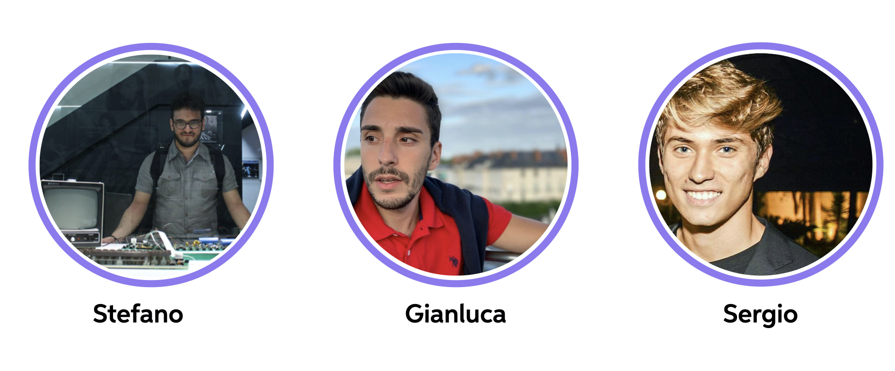

#  The team


We are three students attending the Master of Science of Engineering in Computer Science in Sapienza University of Rome and we are at our last year. We really appreciate working together and we had fun since we enjoy programming and make something that is ours, that has our blueprint. This project takes a while to be fully developed, since we tried to not leave anything to chance, but hopefully include any aspect in the big picture.

##  "All for one, one for all"

Working together may be not simple, sometimes can be complex organize tasks and job, but here we based our work on collaboration and continuous support. Everyone was present to help the others with some issue or just for discuss about some idea or brand new feature to add to our application. **It was a journey, but we enjoyed the trip**. A very good experience. Anyway, let's go in more details about the **contribution of each team member**.

- **Stefano**. Stefano was our backend engineer. He developed all the stuff on the RaspberryPi and the communication with it, he made possible for our PiCamera to recognize people or detect the motion of a stranger breaking in the user's house.

- **Gianluca**. Gianluca took care of enhancing our application with external service, such as Google Maps, Facebook and Google sign in/sign up, in order to get a better UX. He also designed the structure of the Firebase Realtime database with all its nodes.

- **Sergio**. Sergio designed the UI, building mockups and first interactions thanks to programs like AdobeXD. Furthermore, he developed the application according to the MVVM paradigm, dealing with callbacks and communication with the external storage, encouraging everybody to switch to the model.

We have to say that this division was not maintained all the time, but in practice each of us collaborated in order to add functionalities to the app, so boundaries between different roles are blurred. We used the SCRUM approach during the developed of the application, with a sprint that was about of two weeks, trying to accomplish all original user stories we had.

**To learn more about us let's have a look to our LinkedIn profiles:**

- [Gianluca Tasciotti](https://www.linkedin.com/in/gianluca-tasciotti/)
- [Sergio Picca](https://www.linkedin.com/in/sergio-picca-801b0b173/)
- [Stefano Milani](https://www.linkedin.com/in/stefano-milani-561044181/)

## Always need some good music

Programming is a creative process, you may have to focus, since some days are past from the old but gold ```Hello world!```. Personally we all like to listen some music when we are coding, so there we want also to share to anybody would like to hear one of the playlists that supported us in every development day, most important when things didn't go in the right way. [Click here to see the playlist on Spotify](https://open.spotify.com/playlist/4wHgAEXIy9NyLt6mr9AmxX?si=3MMp1biLRrCDl5EaFvVUYQ).


The playlist title is purely random of course ...

### Customizing your jekyll website

This is the base Jekyll theme. You can find out more info about customizing your Jekyll theme, as well as basic Jekyll usage documentation at [jekyllrb.com](https://jekyllrb.com/)

You can find the source code for Minima at GitHub:
[jekyll][jekyll-organization] /
[minima](https://github.com/jekyll/minima)

You can find the source code for Jekyll at GitHub:
[jekyll][jekyll-organization] /
[jekyll](https://github.com/jekyll/jekyll)


[jekyll-organization]: https://github.com/jekyll
