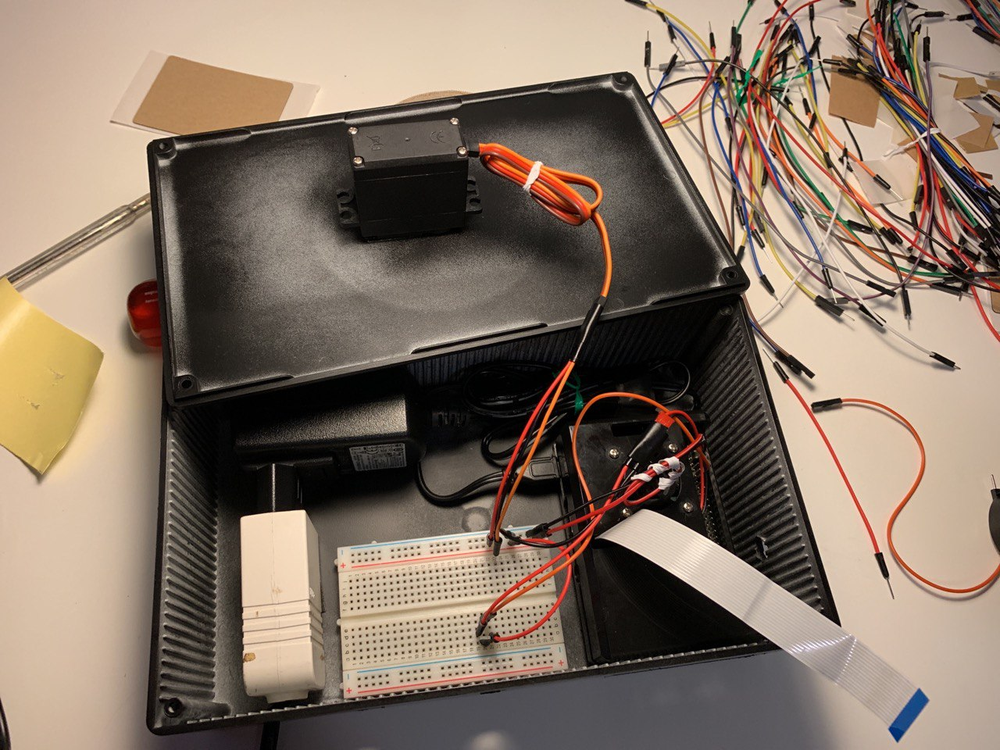

# Raspberry Pi backend

The backend on the Raspberry Pi offers the APIs to manage and control the piCamera module and the servo motor attached on the device.

The backend must be personal and you need to own your Raspberry Pi, camera and motor.

### REST server

The server is developed in python. The choice of this programming language is given by the fact that python offers really good library to handle both the piCamera module and the GPIO pin in PWM mode (needed to handle the servo motor).

To develop the REST APIs it has been used the [Flask library](https://flask.palletsprojects.com/en/1.1.x/). But this library does not offer a server that can be used in production enviroment, to overcome this issue it is used [Waitress](https://docs.pylonsproject.org/projects/waitress/en/stable/), that on the contrary permits to use a Flask server in a production enviroment.

### Handling the camera

It has been used the [piCamera](https://picamera.readthedocs.io/en/latest/) library to develop all the features relative to the camera (stream, motion detection, face recognition).

The camera and the servo motor can be controlled also with Alexa.

A **big thanks** to Adrian and his beatiful tutorials! Check his [website](https://www.pyimagesearch.com) it is really worth it!

In particular:

* [Install OpenCV on Raspberry Pi](https://www.pyimagesearch.com/2018/09/26/install-opencv-4-on-your-raspberry-pi/)
* [Stream and simple motion detection](https://www.pyimagesearch.com/2019/09/02/opencv-stream-video-to-web-browser-html-page/)
* [Motion detection (complete)](https://www.pyimagesearch.com/2015/06/01/home-surveillance-and-motion-detection-with-the-raspberry-pi-python-and-opencv/)
* [Face recognition](https://www.pyimagesearch.com/2018/06/25/raspberry-pi-face-recognition/)
