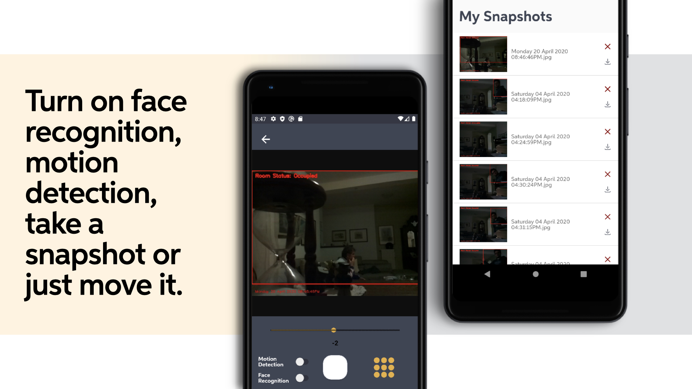

#  Camera

The camera fragment gives the opportunity to the user to manage remotely its piCamera, and to see what happens in his house.

The UI offers:

* A Web view which contains the live stream from the piCamera

* A SeekBar that can be set from -90 to 90 that controls the servo motor on which is attached the camera. That permits to move the camera and too see all corners of your room
* A textView that holds the actual angle on which is set the servo motor
* Two Switch elements that permits to enable/disable the motion detection or the face recogniction. When it is enabled one of the two option it is autimatically disabled the other option if previsiouly enabled
* A Button that offers the possibility to take a snapshot and upload it on Firebase Storage.
* A Button that redirects to the list of images relative to your house

### Handling requests

To remotely manage the piCamera the application performs HTTP requests to the REST server hosted in the Raspberry Pi in your house.
The requests are made using the Volley library. If you know to know more about it, [here](https://developer.android.com/training/volley) you can find the offical documentation.
