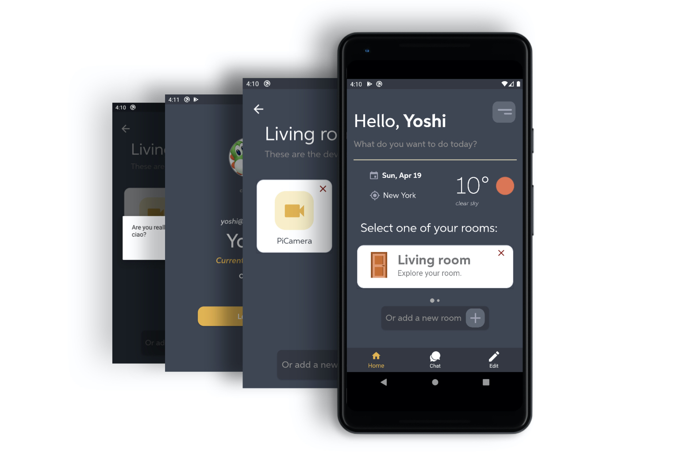
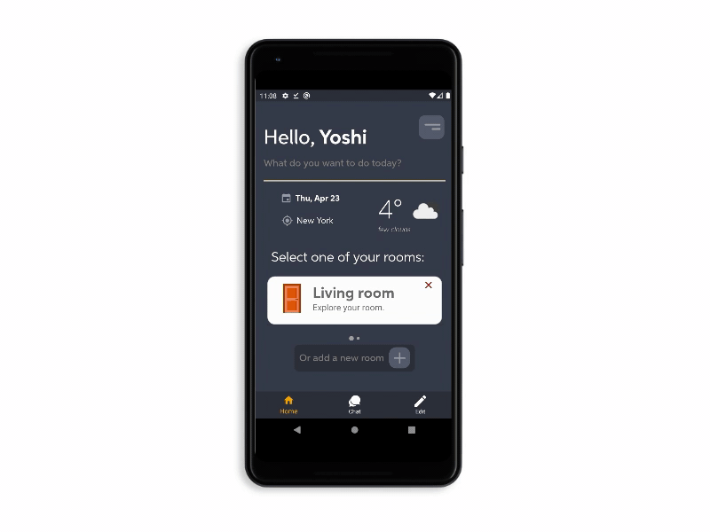

#  Welcome home !
The ```HomeActivity``` is first activity that the user see when starts using the application. Here the user can observe some information about his profile and his house, also with the indication of current weather forecast, depending on the house location.



At the bottom there is a navigation menu, allowing the user to switch between the three different views, in order to [chat](https://sergiopicca.github.io/smartPi-app/pages/ui-chat.html) with its family or [edit](https://sergiopicca.github.io/smartPi-app/pages/ui-edit.html) the info about his house.

##  Rooms 

In the middle of the screen we used an horizontal recycler view in order to display the rooms of the user's house and by clicking on of them there will be the overview of added devices. It is also possible to delete a room or insert a new one by using the button on the bottom on the view, as we can see from the above image. All these actions are supported and specified by the view adapter, in fact **the core task of implementing a recycler view is creating the adapter**, that is defined according to MVVM paradigm. This is our list adapter, with a more clean structure.

```java
class RoomAdapter(val clickListener: RoomListener): ListAdapter<Room, RoomAdapter.ViewHolder>(RoomNightDiffCallback()) {
    private var listener: ((item:Room) -> Unit)? = null

    fun deleteRoom(listener: (item: Room) -> Unit) {
        this.listener = listener
    }

    override fun onCreateViewHolder(parent: ViewGroup, viewType: Int): ViewHolder {
        return ViewHolder.from(parent)
    }

    override fun onBindViewHolder(holder: ViewHolder, position: Int) {
        val item = getItem(position)
        holder.bind(item, clickListener, listener)
    }
```

The ```deleteRoom()``` assign the listener in order to correctly perform the deletion of one room, actually the real deletion of a room is implemented in the ```HomeViewModel```  class. The ```onBindViewHolder()``` function is called by RecyclerView to display the data for one list item at the specified position. Then, we have the ```ViewHolder``` that is where the magic happens, since we specify the components of the item layout, such as the name of the room, the subtitle and most important the click listener for accessing the item or for deleting the item.

```java
    class ViewHolder private constructor(val binding: RoomItemViewBinding) : RecyclerView.ViewHolder(binding.root){
        fun bind(
            item: Room,
            clickListener: RoomListener,
            listener: ((item: Room) -> Unit)?
        ) {
            binding.room = item

            // Assign the text in the card
            binding.roomName.text = item.name.capitalize()
            binding.devNumber.text = "Explore your room."
            binding.delete.setOnClickListener{listener?.invoke(item)}

            // Assign the click listener
            binding.clickListener = clickListener
            binding.executePendingBindings()
        }

        companion object {
            fun from(parent: ViewGroup): ViewHolder {
                val layoutInflater = LayoutInflater.from(parent.context)
                val binding = RoomItemViewBinding.inflate(layoutInflater, parent, false)
                return ViewHolder(binding)
            }
        }
    }
}

```
Then we have two additional classes. The former to compare two items of a list by using two methods which may remind to us the ```equals``` and ```hashcode``` overriding best practice in Java, actually is pretty the same idea, since with ```areItemTheSame``` we compare just the id of two items (**shallowly equality**), while ```areContentsTheSame``` we compare the **contents** of two items (**deeply equality**). The latter simple handles the click on one item.

```java
class RoomNightDiffCallback : DiffUtil.ItemCallback<Room>() {
    // Room are the same if the have the same id
    override fun areItemsTheSame(oldItem: Room, newItem: Room): Boolean {
        return oldItem.roomId == newItem.roomId
    }

    // Checking if rooms contain the same data
    override fun areContentsTheSame(oldItem: Room, newItem: Room): Boolean {
        return oldItem == newItem
    }

}

// Listener for handling the click
class RoomListener(val clickListener: (r: Room) -> Unit) {
    fun onClick(room: Room) = clickListener(room)
}
```

##  My profile

Moreover, on the top in the right corner we have a button about showing the user profile and a recap of his personal information, such as the **status**, meaning if is an owner or a guest, his email and there is also a button for logging out. We give the possibility to the user to change its profile image by selecting it from the gallery, as show above.



This is done by simply using intent and then get the result by overriding the ```onActivityResult()``` method and call one function of the ```HomeViewModel``` class to store the new image in the Firebase Storage.
