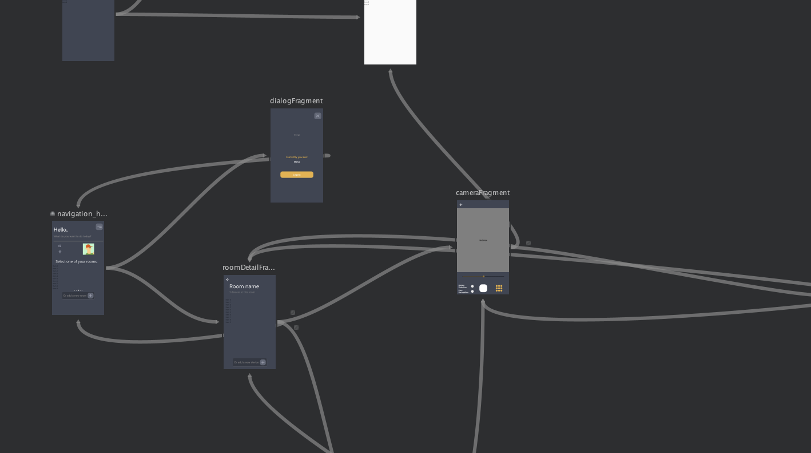
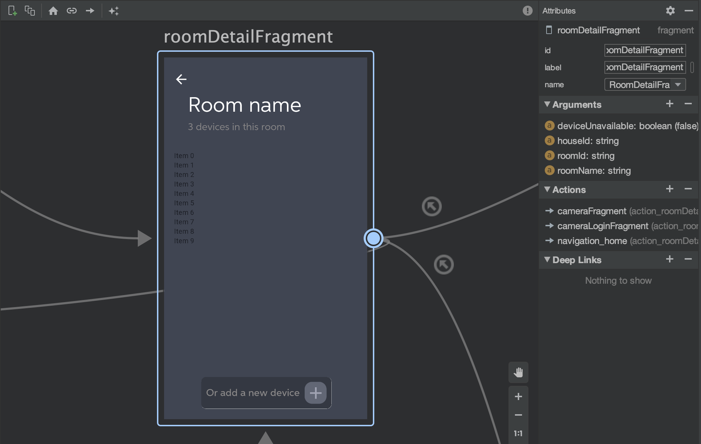
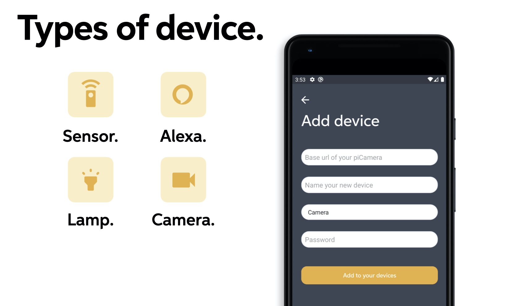

#  Room details

Once the user click on a particular room, this is the view presenting the devices of the room. Here the user can select one device, depending what he or she would like to do. For our application we actually implemented only the camera, so the other device are simply *unavailable*; however the application can be extended for instance to control some lights in the room, actually this functionality will be probably included in one next version.

## Premise: android jetpack's navigation

In order two switch between fragments we used a feature of Android Jetpack that is the **Navigation component**. Historically to switch between views of your application you did this by using intents or fragments transactions, which in simple cases was enough. However in case of bottom navigation or conditional navigation, the old approach may be not sufficient and here is where the new component shines! Here you can take a look to a portion of our navigation graph.



As you can see from the image, the interface of the editor is pretty simple you add fragments to the graph, you drag an arrow to the destination and that's it. This way of managing navigation is very useful also for dealing with many stuff, such as animations, fragment transactions, but in particular with the **backstack**. Backstack can be a really issue because if you don't correctly take care of it you can **loop between fragments using the back button** and this will cause a really annoying user experience. Another important feature is the **Safe argument passing** that is extremely useful to pass some important information to some fragment and this is where the **rooms come into play**. The user can see the list of rooms from its home, he can scroll between them, add, delete or just select one of them. When the user select the room we decided to avoid to fetch again the data, so we simply passes some additional information using the self-generated code of SafeArgs plugin. First we have to add the plugin to our Gradle (app level), then this will automatically generate classes related to the navigation graph: **args classes** for any destination with arguments and **directions classes** for each any destination with actions (arrows). Finally, you have to select the destination from the graph, in this case the ```RoomDetailFragment``` and you've done.



In this case we pass just four parameters, that are necessary to display in a correct way the room, in particular we have the ```roomId```, the ```roomName``` and the ```houseId```. These three parameters (the ```deviceUnavaiable``` will be used later) are important to retrieve the devices from the correct room in the correct house, namely to specify in a proper manner the path in the json file on the Firebase Realtime database.

##  Room detail fragment

In our code the fragment holding the room is called ```RoomDetailFragment```, that hosts a recycler view with a **grid layout** to display the devices:
```java
// Set the GridLayout
val manager = GridLayoutManager(activity, 2)
binding.deviceList.layoutManager = manager

// Change the view
// Add the room name
binding.name.text = roomName
binding.labelDevices.text = deviceLabel

// Get the devices of the room
roomDetailViewModel.getDevices(homeId,roomId)

// Pass the devices to the adapter
roomDetailViewModel._devices.observe(viewLifecycleOwner, Observer {
    it?.let {
        adapter.submitList(it)
    }
})
```
In the above code we set the grid layout, we assign the room name, the subtitle (the label), and we call the function from the view model in order to get the devices from the real-time database, so we observe the variable ```_devices```  that is a Mutable LiveData, holding all the devices of the room and once the data is ready we assign the list to the adapter. Then we give the possibility to the user to add some device and we he push the button on the bottom he will see the following view.



Depending on the choice of the user a different icon of the device will be displayed. This is kind of selection is done inside the adapter of the devices' recycler view.
