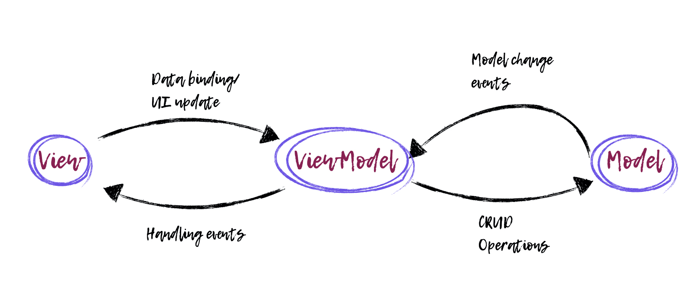

#  Design of the application

In this section will be describe the user interface of the SmartPi application. We used Android Studio for developing the front-end and we write the app in **Kotlin**, in order to try something different from Java. The design of the application is based on the **Model View ViewModel** (MVVM), since we tried to follow the suggestions of the Android documentation.

##  Concept of activity

Every Android App is made up of activities that initiates code invoking specific callbacks methods. The activity typically provides the screen where the user interaction takes place and it can occupy the whole screen or not, so one application can contain more activities or fragments. Furthermore an activity can host one or more fragments (a sort of "sub-activity") to support more dynamic and flexible UI, more info can be find in the official [developer android documentation](https://developer.android.com/guide/components/fragments).

## Model View ViewModel

Apart from the official documentation there is an interesting article on Medium that explain in a clever and fast way the MVVM design architecture, that you can find [here](https://medium.com/upday-devs/android-architecture-patterns-part-3-model-view-viewmodel-e7eeee76b73b). Basically, the most important principle to follow is the **separation of concern**, trying to avoid to write all the code inside the activity or the fragment.

The above image describes the model and its main components, so let's examine them.

1. **View**. The view is responsible ...
2. **ViewModel**.
3. **Model**.
